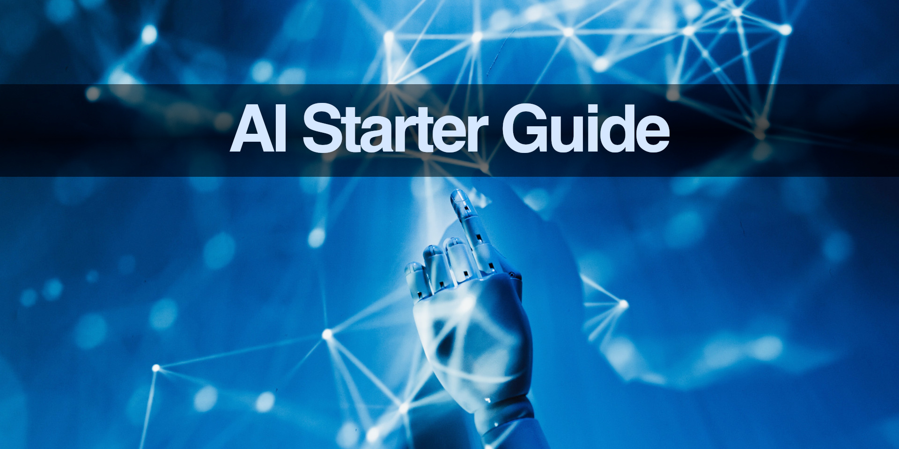

# AI Starter Guide

AI Starter Guide: this book explains one topic at a time, like a big glossary, easy wiki, quick encyclopedia, or summary notes.

* Download the [free ebook](ai-starter-guide.pdf).
* If you wish, [pay what you want](https://gumroad.com/l/ai-starter-guide).
* Edited by [Joel Parker Henderson](https://github.com/joelparkerhenderson).
* For questions and suggestions [email me](mailto:joel@joelparkerhenderson.com).

## All our guides

* [AI Starter Guide](https://github.com/sixarm/ai-starter-guide)
* [Innovation Partnership Guide](https://github.com/sixarm/innovation-partnership-guide)
* [Startup Business Guide](https://github.com/sixarm/startup-business-guide)
* [Business Lingo Guide](https://github.com/sixarm/business-lingo-guide)
* [Project Management Guide](https://github.com/sixarm/project-management-guide)
* [UI/UX Design Guide](https://github.com/sixarm/ui-ux-design-guide)
* [Software Programming Guide](https://github.com/sixarm/software-programming-guide)
